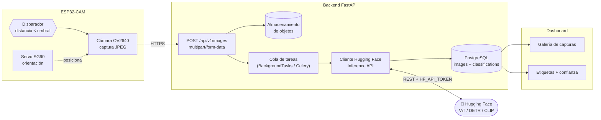
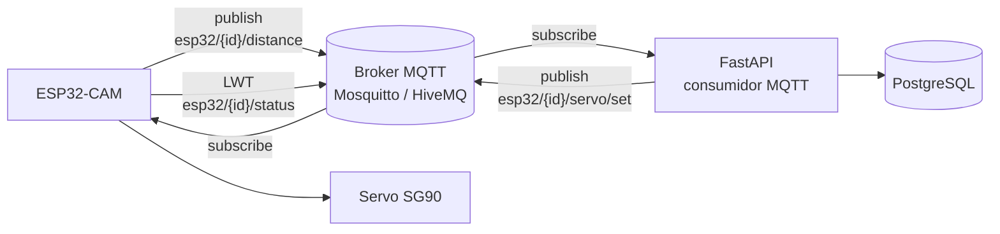
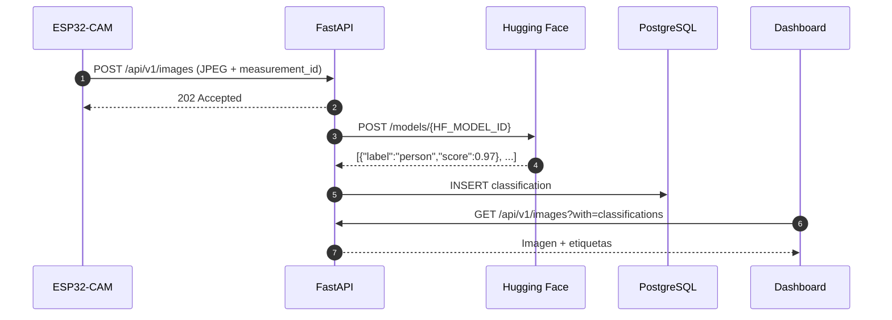

# 5. Pipeline de futuras integraciones IA

## Visión artificial con ESP32-CAM y Hugging Face

```mermaid
flowchart LR
    subgraph EDGE["ESP32-CAM"]
        T{{"Disparador<br/>distancia < umbral"}}
        CAM["Cámara OV2640<br/>captura JPEG"]
        SERVO["Servo SG90<br/>orientación"]
        T --> CAM
        SERVO -. "posiciona" .-> CAM
    end

    subgraph BACK["Backend FastAPI"]
        UP["POST /api/v1/images<br/>multipart/form-data"]
        ST[("Almacenamiento<br/>de objetos")]
        Q["Cola de tareas<br/>(BackgroundTasks / Celery)"]
        HF["Cliente Hugging Face<br/>Inference API"]
        DB[("PostgreSQL<br/>images + classifications")]
        UP --> ST
        UP --> Q --> HF
        HF --> DB
    end

    HUB(["🤗 Hugging Face<br/>ViT / DETR / CLIP"])

    subgraph FRONT["Dashboard"]
        G["Galería de capturas"]
        L["Etiquetas + confianza"]
    end

    CAM -- "HTTPS" --> UP
    HF <-- "REST + HF_API_TOKEN" --> HUB
    DB --> G
    DB --> L
```

## Integración MQTT y control del servo

```mermaid
flowchart LR
    ESP["ESP32-CAM"] -- "publish<br/>esp32/{id}/distance" --> BR[("Broker MQTT<br/>Mosquitto / HiveMQ")]
    ESP -- "LWT<br/>esp32/{id}/status" --> BR
    BR -- "subscribe" --> BE["FastAPI<br/>consumidor MQTT"]
    BE --> DB[("PostgreSQL")]
    BE -- "publish<br/>esp32/{id}/servo/set" --> BR
    BR -- "subscribe" --> ESP
    ESP --> SG["Servo SG90"]
```

## Secuencia de clasificación

```mermaid
sequenceDiagram
    autonumber
    participant ESP as ESP32-CAM
    participant API as FastAPI
    participant HF as Hugging Face
    participant DB as PostgreSQL
    participant UI as Dashboard

    ESP->>API: POST /api/v1/images (JPEG + measurement_id)
    API-->>ESP: 202 Accepted
    API->>HF: POST /models/{HF_MODEL_ID}
    HF-->>API: [{"label":"person","score":0.97}, ...]
    API->>DB: INSERT classification
    UI->>API: GET /api/v1/images?with=classifications
    API-->>UI: Imagen + etiquetas
```
