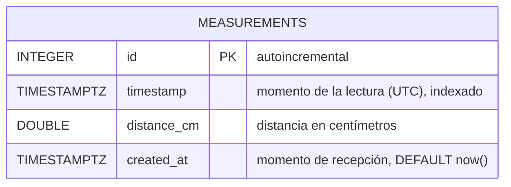
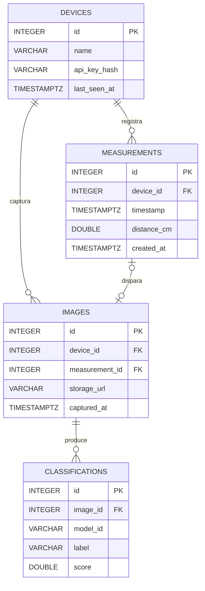

# 6. Modelo de datos

## Esquema actual

```mermaid
erDiagram
    MEASUREMENTS {
        INTEGER id PK "autoincremental"
        TIMESTAMPTZ timestamp "momento de la lectura (UTC), indexado"
        DOUBLE distance_cm "distancia en centímetros"
        TIMESTAMPTZ created_at "momento de recepción, DEFAULT now()"
    }
```

## Evolución prevista

```mermaid
erDiagram
    DEVICES ||--o{ MEASUREMENTS : registra
    DEVICES ||--o{ IMAGES : captura
    MEASUREMENTS |o--o| IMAGES : dispara
    IMAGES ||--o{ CLASSIFICATIONS : produce

    DEVICES {
        INTEGER id PK
        VARCHAR name
        VARCHAR api_key_hash
        TIMESTAMPTZ last_seen_at
    }
    MEASUREMENTS {
        INTEGER id PK
        INTEGER device_id FK
        TIMESTAMPTZ timestamp
        DOUBLE distance_cm
        TIMESTAMPTZ created_at
    }
    IMAGES {
        INTEGER id PK
        INTEGER device_id FK
        INTEGER measurement_id FK
        VARCHAR storage_url
        TIMESTAMPTZ captured_at
    }
    CLASSIFICATIONS {
        INTEGER id PK
        INTEGER image_id FK
        VARCHAR model_id
        VARCHAR label
        DOUBLE score
    }
```
